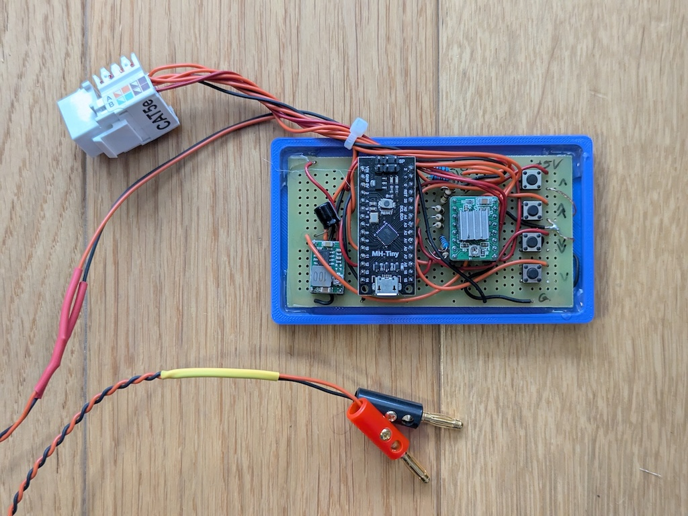
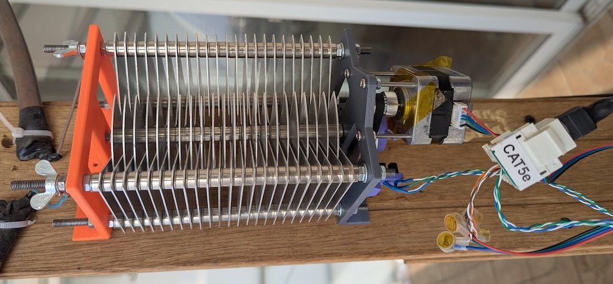

# antenna-tuner

Simple antenna tuner to tune a variable air capacitor for a magnetic loop antenna.

### Uses

- [ATTiny88](https://github.com/SpenceKonde/ATTinyCore/blob/v2.0.0-devThis-is-the-head-submit-PRs-against-this/avr/extras/ATtiny_x8.md)
- [Pololu A4988](https://www.pololu.com/product/1182)
